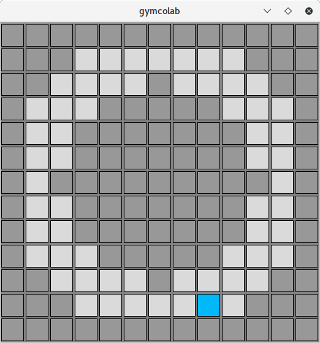

## GymColab

2D gym environments based on [pycolab](https://github.com/deepmind/pycolab) game engine. Grid environment provides visualization and analysis tools for reinforcement learning research. Visualizations are based on cropper objects of the pycolab.



**Note**: Project under development!

### Install
``` cd gymcolab ```

``` pip install -e .```

### Example Worldz
    - Pycolab examples
    - DonutWorld